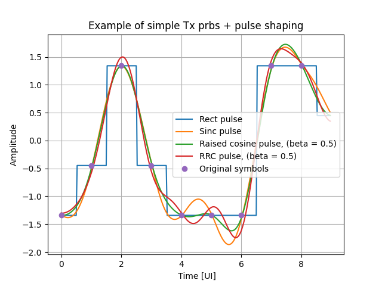
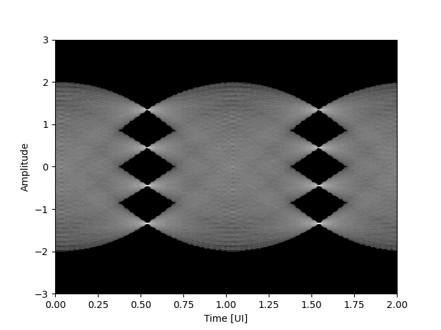
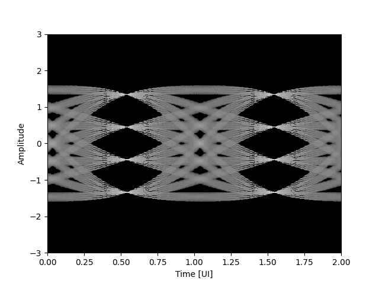
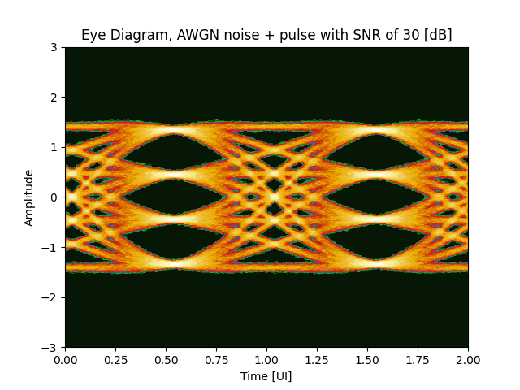
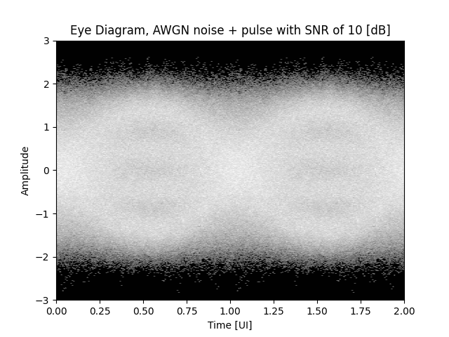
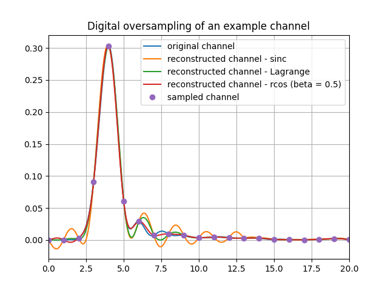

# CommDspy
Repository for the communication signal processing package

Developed by: Tomer Geva

## Example uses:
### Generating OSR1 and OSR `n` signal
```python
import CommDspy as cdsp
import numpy as np
def tx_example():
    # ==================================================================================================================
    # Local variables
    # ==================================================================================================================
    prbs_type       = cdsp.constants.PrbsEnum.PRBS13
    bits_per_symbol = 2
    bit_order_inv   = False
    inv_msb         = False
    inv_lsb         = False
    pn_inv          = False
    constellation   = cdsp.constants.ConstellationEnum.PAM4
    full_scale      = True
    coding          = cdsp.constants.CodingEnum.UNCODED
    poly_coeff      = cdsp.get_polynomial(prbs_type)
    init_seed       = np.array([1] * prbs_type.value)
    prbs_len        = 25  # can be any number
    # ==================================================================================================================
    # Creating reference pattern
    # ==================================================================================================================
    # --------------------------------------------------------------------------------------------------------------
    # Getting PRBS binary pattern
    # --------------------------------------------------------------------------------------------------------------
    prbs_seq, seed_dut = cdsp.tx.prbs_gen(poly_coeff, init_seed, prbs_len)
    # --------------------------------------------------------------------------------------------------------------
    # Duplicating if needed and coding
    # --------------------------------------------------------------------------------------------------------------
    prbs_bin_mult = np.tile(prbs_seq, bits_per_symbol)
    pattern       = cdsp.tx.bin2symbol(prbs_bin_mult, 2 ** bits_per_symbol, bit_order_inv, inv_msb, inv_lsb, pn_inv)
    pattern       = cdsp.tx.coding(pattern, constellation, coding, full_scale=full_scale)
    
pattern = tx_example()
# ==================================================================================================================
# Pulse shaping
# ==================================================================================================================
rolloff     = 0.5
tx_out_rect = cdsp.channel.pulse_shape(pattern,osr=32, span=8, method='rect')
tx_out_sinc = cdsp.channel.pulse_shape(pattern,osr=32, span=8, method='sinc')
tx_out_rcos = cdsp.channel.pulse_shape(pattern,osr=32, span=8, method='rcos', beta=rolloff)
tx_out_rrc  = cdsp.channel.pulse_shape(pattern,osr=32, span=8, method='rrc', beta=rolloff)
```
Results:



**Figure 1** - Simple Tx example

The pulse shaped signal can be plotted as an eye diagram as follows:
```python
eye_d, amp_vec = cdsp.eye_diagram(tx_out_rcos, 32, 128, fs_value=3, quantization=2048, logscale=True)
```
The results can be seen using `matplotlib.pyplot` functions such as `contourf`:


**Figure 2** Eye diagram of PRBS13 after raised cosine pulse shaping with rolloff of 0.5, logscale plot



**Figure 3** Eye diagram of PRBS13 after raised cosine pulse shaping with rolloff of 0.9, logscale plot

## Passing a signal through channels
The package can be used to pass a signal through different channels
#### AWGN
Adding white gaussian noise on top of the pulse shaping, this is done by:
```python
rolloff = 0.9
snr     = 30
pattern = tx_example()
ch_out  = cdsp.channel.awgn(pattern, osr=32, span=8, method='rcos', beta=rolloff, snr=snr)
eye_d, amp_vec = cdsp.eye_diagram(ch_out, 32, 128, fs_value=3, quantization=2048, logscale=False)
time_ui = np.linspace(0, 2, 256)
```
The result can be shown in the form of an eye diagram:



**Figure 3** AWGN eye diagran, rolloff 0.9 and SNR 30 [dB]



**Figure 3** AWGN eye diagran, rolloff 0.9 and SNR 10 [dB]

## Digital oversampling
```python
import numpy as np
import os
import CommDspy as cdsp
import json

# ==================================================================================================================
# Local variables
# ==================================================================================================================
order = 16
beta  = 0.5
# ==================================================================================================================
# Loading data
# ==================================================================================================================
f = open(os.path.join('..','test_data', 'example_channel_full.json'))
data = json.load(f)
f.close()
channel             = np.array(data['channel'])
channel_ui          = data['channel_ui']
channel_sampled     = data['channel_sampled']
osr                 = data['osr']
ch_segment          = channel[order // 2 * osr: -1*(((order // 2)-1) * osr - 1)]
# ==================================================================================================================
# Digital up-sampling DUT
# ==================================================================================================================
channel_upsample_lag, x2, x1 = cdsp.digital_oversample(channel_sampled, osr=osr, order=order, method='lagrange')
channel_upsample_sinc, _, _  = cdsp.digital_oversample(channel_sampled, osr=osr, order=order, method='sinc')
channel_upsample_rcos, _, _  = cdsp.digital_oversample(channel_sampled, osr=osr, order=order, method='rcos', beta=beta)
```
Results:



**Figure 4** - channel reconstruction
```Python
# Sinc interpolation MSE          = -17.68 [dB]
# Lagrange interpolation MSE      = -23.59 [dB]
# Raised Cosine interpolation MSE = -29.84 [dB]
```

# Functions' Description
## 0. Auxilliaty functions:
### 0.1. get_polynomial
Function receives the PRBS type enumeration (detailed below) and returns the commonly used generating polymonial coefficients for the PRBS pattern
### 0.2. get_levels
Function receives the constellation enumeration (detailed below) and returns the levels in the constellation. The function containg a "full_scale" flag. In case this flag is True, the levels are scaled such that random data which is coded to this constellation will have mean power of 1 (0 [dB])
### 0.3. power
Function receives a signal, returns the mean power of the signal
### 0.4. rms
Function receives a signal, returns the RMS of the signal
### 0.5. buffer
Function receives a signal and breaks is into overlapping parts. Function is inputted with:
* signal - Input numpy array vector to be buffered
* length - The length of the chunks to be returned, should be a non-zero integer
* overlap=0 - The number of overlapping symbols in the signal between each rows. Default is 0, i.e. no overlap. for values larger than 0, there will be overlap and for values smaller than 0 the following row will skip the respective number of symbols
* delay=0 - The number of zero padding to perform over the beginning of the signal
* clip=False - If False, padding the end of the signal with zeros such that the last row will have "length" length. If True, clips the data to match the length "length"
Function returns a 2D numpy array with "length" length rows. 

## 1. Tx sub-package information
### 1.1. prbs_gen
Function receives polynomial coefficients and an initial seed, creates binary PRBS sequences of the requested length . The function is inputted with:
* poly_coeff - a coefficent vector for the generating polynomial of the PRBS pattern
* init_seed - initial seed used to generate the pattern
* output_length - wanted pattern length

### 1.2. PrbsIterator
An iterable used to generate the next bit in the given PRBS. during initialization, a seed and the generating polynomial are given to the object. after calling iter(), next() can be used to pop the next bit in the PRBS

### 1.3. bin2symbol
Function receives a binary sequence and computes the UNCODED symbols matching the binary sequence. The function is inputted wiith:
* bin_mat - The binary sequence wanted to be converted 
* num_of_symbols - The number of symbols in the UNCODED pattern. NOW ONLY SUPPORTS POWERS OF 2 (2, 4, 8, ...)
* bit_order_inv=False - Booleans stating if we want to invert the bit order (By default, MSB is the rightmost bit and the LSB is the leftmost bits)
* inv_msb=False - Boolean stating if we want to invert the msb
* inv_lsb=False - Boolean stating if we want to invert the lsb
* pn_inv=False - Boolean stating if we want to invert all bits 

### 1.4. coding
Function used to code the pattern. Function is inputted with:
* pattern - Input pattern of UNCODED symbols which should be coded
* constellation=ConstellationEnum.PAM4 - Wanted constellation
* coding=CodingEnum.UNCODED - Wanted coding, either UNCODED or GRAY
* pn_inv=False - Boolean stating if we want to invert the levels after coding
* full_scale=False - Boolean stating if we want to set the levels such that the mean power will be 1 (0 [dB])

### Various pulse generators
The package supports all the pulses written in 1.5. above. The function names are:
* rrc_pulse
* rcos_pulse
* sinc_pulse
* rect_pulse
Read the respective description for further information

## 2. Rx sub-package information
### 2.1. slicer
Function receives data matrix from the slicer input and performs the slicing operation.
* slicer_in_mat - Inputs to slice
* levels=None - constellation points. The decision thresholds are at the midpoints to the constellations. If the user does not insert levels it assumes [-3,-1,1,3]

### 2.2. symbol2bin
Function receives an UNCODED symbol sequence, returns the binary representation of the symbol sequence
  * symbol_mat - The binary sequence wanted to be converted 
  * num_of_symbols - The number of symbols in the UNCODED pattern. NOW ONLY SUPPORTS 2 and 4
  * bit_order_inv=False - Booleans stating if we want to invert the bit order (By default, MSB is the rightmost bit and the LSB is the leftmost bits)
  * inv_msb=False - Boolean stating if we want to invert the msb
  * inv_lsb=False - Boolean stating if we want to invert the lsb
  * pn_inv=False - Boolean stating if we want to invert all bits

### 2.3. decoding
Function used to decode the pattern. Function is inputted with:
* pattern - Input pattern of coded symbols which should be decoded
* constellation=ConstellationEnum.PAM4 - Constellation used for the coding of the pattern signal
* coding=CodingEnum.UNCODED - Coding used in the creation of the pattern signal, either GRAY of UNCODED
* pn_inv=False - Boolean stating if the levels were inverted after coding

### 2.4. prbs_checker
Function receives a slicer out capture matrix (or slicer in matrix after offine slicing) and does the following:
1. builds a reference PRBS sequence
2. synchronizes on the pattern
3. checks BER
4. returns the "lost lock" indication, nunber of correct bits and the vector with '0' in the correct locations, '1' in the error locations

The function is inputted with:
* prbs_type - Enumeration stating the type of PRBS we used for the data-in
* data_in - The data we want to check the errors on
* init_lock - indicating if the data-in is aligned with the reference PRBS (with init seed of ones)
* loss_th=100 - number of erred bit in the data to consider loss of PRBS lock

### 2.5. prbs_ana_econ - THIS FUNCTION IS STILL SUBJECT TO TESTING
Does the same as prbs_ana but, this function is more memory efficient at the cost of longer runtime

## 3. Channel sub-package information
### 3.1. pulse_shape
Function useed to perform pulse shaping to the inputted discrete signal. Function is inputted with:
* signal - Input signal in OSR 1 for the pulse shaping
* osr - The wanted Over Sampling Rate after the shaping
* span - The span of the pulse, the span is symmetrical, i.e. a span of 8 means 8 symbols back and 8 symbols forward
* method - The shape of the pulse. can be either:
  * 'rect' - rectangular pulse
  * 'sinc' - sinc pulse
  * 'rcos' - raised cosine pulse with roll-off parameter beta
  * 'rrc' - root raised cosine pulse with rolloff parameter beta

This function simulated a perfect channel, i.e. ch[n] = delta[n] therefore at the end of the channel we only have the pulse shaping.

### 3.2. awgn
Function that adds Additive White Gaussian Noise in a power to create a wanted SNR. Function is inputted with:
* signal - input we and to add the AWGN to
* snr - the SNR of the signal w.r.t the added noise

### 3.3. awgn_channel
Function that passes a signal through a discrete-time channel and adds AWGN to the output. Function is inputted with:
* signal - the signal we want to pass through the channel
* b - The polynomial coefficients of the channel's nominator
* a - The polynomial coefficients of the channel's denominator. if a[0] is not 1, all a and b coefficients are normalized by a[0]
* snr=None - The AWGN SNR to be added to the channel output, If None, does not add noise at all

## 4. Signal analysis

### 4.1. channel_estimation_prbs
Function which performs channel estimation, assuming that the original pattern is a PRBS pattern using the get_polynomial generating polynomials. Function is inputted with:
* prbs_type - Enumeration stating the type of PRBS used to generate the original data
* signal - Channel output data we use to estimate the channel
* constellation - Constellation used in the coding of the symbols
* prbs_full_scale=False - Flag stating if the transmission has a mean power of 1 (0 [dB])
* channel_postcursor=500 - Number of postcursors we want to use for the channel estimation
* channel_precursor=19 - Number of precursors we want to use for the channel estimation
* normalize=False - If ture, normalizes the channel impulse response ot have a peak value of 1
* bit_order_inv=False -  Boolean indicating if the bit order in the signal generation is flipped
* pn_inv_precoding=False - Boolean indicating if the P and N were flipped in the signal capture process before the coding
* code=CodingEnum.UNCODED - Enumeration of the coding type used in the signal, taken from CommDspy.constants.CodingEnum
* pn_inv_postcoding=False - Boolean indicating if the P and N were flipped in the signal capture process after the coding

Function returns the channel impulse response and the sum of squared residuals between the "signal" and the estimated channel's output

### 4.2. equalization_estimation_prbs
Function which preform equalization over the input signal, estimation the MMSE equalizer to be used to invert the 
    ISI in the signal and recover the original data, using either an FFE or/and a DFE with controllable number of taps. Function is inputted with:
* prbs_type: Type of PRBS used. This variable should be an enumeration from the toolbox. In the case of PRBSxQ
                      patterns, use the bits_per_symbol to generate the pattern 
* signal: The signal we want to use to estimate the channel 
* constellation: Enumeration stating the constellation. Should be taken from CommDspy.constants.ConstellationEnum 
* prbs_full_scale: Boolean stating if we want the levels to be scaled such that the mean power of the levels  at the transmitter will be 1 (0 [dB]), i.e. that the PRBS pattern will be coded to power of 0 [dB]
* ffe_postcursor: Number of postcursors in the FFE estimation 
* ffe_precursor: Number of precursors in the FFE estimation 
* dfe_taps: Number of postcursors in the DFE estimation 
* normalize: Boolean stating if the user wants to normalize the Rx FFE such that the peak will have value of 1
* regularization: String indicating the regularization in the computation of the equalizer. Can be either:
  * 'None' - Ordinary Least Squares (OLS) solving without regularization
  * 'ridge' - Applying ridge regression, L2 regularization
  * 'lasso' - Applying lasso regression, L1 regularization
* reg_lambda: If regularization is not 'None', and reg_lambda != 0, applies the wanted regularization with a regularization factor of reg_lambda
* The Following flags are only relevant for constellation with multiple bits per symbol:
  * bit_order_inv: Boolean indicating if the bit order in the signal generation is flipped. 
  * pn_inv_precoding: Boolean indicating if the P and N were flipped in the signal capture process before the coding. 
  * gray_coded: Boolean indicating if the signal is GRAY coded, if False, UNCODED 
  * pn_inv_postcoding: Boolean indicating if the P and N were flipped in the signal capture process after the coding.

Function returns:
* ffe: The equalization FFE, normalized such that the cursor will have a value of 1 
* dfe: The equalization DFE 
* dig_gain: The digital gain of the system. Note that this is highly dependant on the constellation 
* ls_err: Sum of squared residuals 
* mse: normalized MSE, meaning the MSE divided by the variance of the constellation, in dB units

### 4.3. dig_delay_lagrange_coeffs
Function uses *Lagrange* interpolation polynomials to produce digital delay filter coefficients. Function is inputted with:
* n - The order of the filter
* alpha - the fractional delay wanted. alpha must be between 0 and 1
* forward - Boolean stating the favorite location when the filter order is odd. If filter order is 1 then forward must be True for the function to work

### 4.4. dig_delay_sinc_coeffs
Function uses *sinc* interpolation to produce digital delay filter coefficients. Function is inputted with:
* n - The order of the filter
* alpha - the fractional delay wanted. alpha must be between 0 and 1
* forward - Boolean stating the favorite location when the filter order is odd. If filter order is 1 then forward must be True for the function to work

### 4.5. dig_delay_rcos_coeffs
Function uses *raised cosine* interpolation to produce digital delay filter coefficients. Function is inputted with:
* n - The order of the filter
* alpha - the fractional delay wanted. alpha must be between 0 and 1
* forward - Boolean stating the favorite location when the filter order is odd. If filter order is 1 then forward must be True for the function to work
* beta - rolloff factor for the raised cosine

### 4.5. digital_oversample
Function performs digital oversampling by applyting digital delat filters and fusing the results into 1 flattened array. Function is inputted with:
* signal_vec - Input signal for oversampling
* osr - Over sampling rate wanted, should be an integer
* order - Order of the filter to be computed
* method - the method of interpolation, can be:
  * 'lagrange'
  * 'sinc'
  * 'rcos'
* beta=0 - rolloff factor in case the method chosen is 'rcos'

### 4.6. eye_diagram
Function computed the eye diagram of a signal. Function is inputted with:
* signal - Input signal to plot the eye diagram
* osr_in - Over Sampling Rate of the signal
* osr_diag - Over Sampling used to plot the eye, if larger than `osr_in` then performing sinc interpolation 
* fs_value=1 - the limits of the eye diagram
* quantization=256 - resolution of the amplitudes in the eye diagram is computed by: `2*fs_value / qualtization`
* logscale=False - If True, returns the eye diagram with logscale values

## 5. Enumeration classes
### 5.1.PrbsEnum 
Enumeration for the PRBS type used
  * PRBS7
  * PRBS9 
  * PRBS11
  * PRBS13
  * PRBS15
  * PRBS31

### 5.2. ConstellationEnum
Enumeration for the constellations used
  * NRZ - Non-Return to Zero, assuming constellation of [-1, 1]
  * OOK - On Off Keying, assuming constellation of [0, 1]
  * PAM4 - Pulse Amplitude Modulation 4, assuming constellation of [-3, -1, 1, 3]

### 5.3. CodingEnum
enumeration of the different coding types
  * UNCODED
  * GRAY
  
# To update the version:
 1. please run the following command from the respective directory:
        
        python3 setup.py bdist_wheel

 2. please run the following command:

        pip install dist/labsignalprocess-<VERSION>-py3-none-any.whl 
 