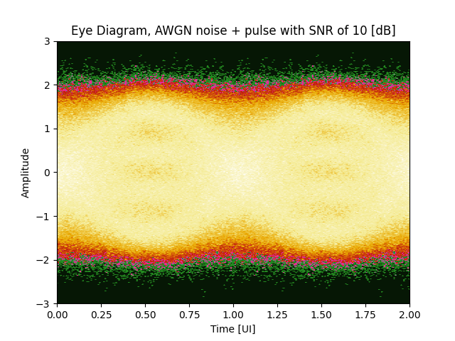
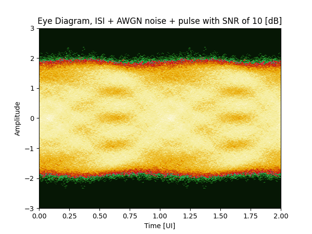
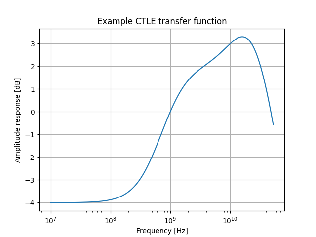
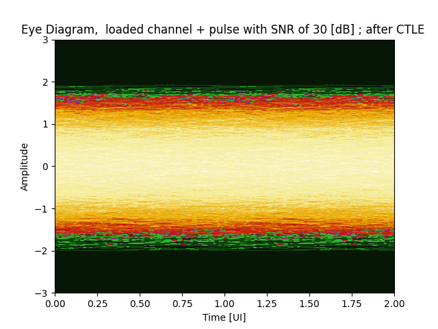
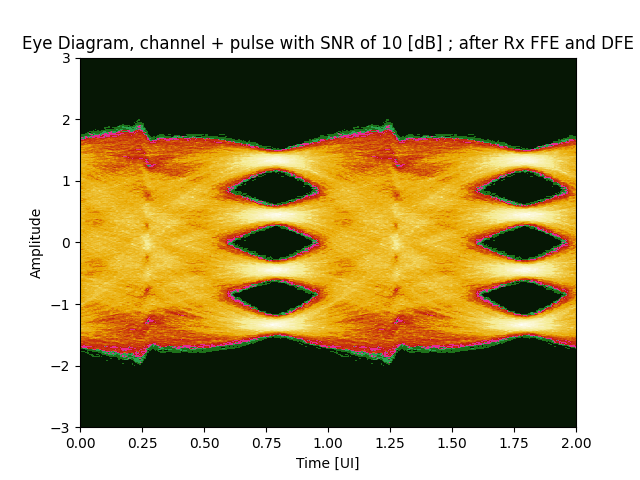

# CommDspy
Repository for the communication signal processing package

Developed by: Tomer Geva

## Example uses:
### Generating OSR1 and OSR `n` signal


```python
import CommDspy as cdsp
import numpy as np
def tx_example():
    # ==================================================================================================================
    # Local variables
    # ==================================================================================================================
    prbs_type       = cdsp.constants.PrbsEnum.PRBS13
    bits_per_symbol = 2
    bit_order_inv   = False
    inv_msb         = False
    inv_lsb         = False
    pn_inv          = False
    constellation   = cdsp.constants.ConstellationEnum.PAM4
    full_scale      = True
    gray_coding     = False 
    poly_coeff      = cdsp.get_polynomial(prbs_type)
    init_seed       = np.array([1] * prbs_type.value)
    prbs_len        = 25  # can be any number
    # ==================================================================================================================
    # Creating reference pattern
    # ==================================================================================================================
    # --------------------------------------------------------------------------------------------------------------
    # Getting PRBS binary pattern
    # --------------------------------------------------------------------------------------------------------------
    prbs_seq, seed_dut = cdsp.tx.prbs_gen(poly_coeff, init_seed, prbs_len * bits_per_symbol)
    # --------------------------------------------------------------------------------------------------------------
    # Duplicating if needed and coding
    # --------------------------------------------------------------------------------------------------------------
    pattern       = cdsp.tx.bin2symbol(prbs_seq, 2 ** bits_per_symbol, bit_order_inv, inv_msb, inv_lsb, pn_inv)
    pattern       = cdsp.tx.mapping(pattern, constellation, full_scale) if not gray_coding else cdsp.tx.mapping(cdsp.tx.coding_gray(pattern, constellation), constellation, full_scale)

    return pattern
    
pattern = tx_example()
# ==================================================================================================================
# Pulse shaping
# ==================================================================================================================
rolloff     = 0.5
tx_out_rect = cdsp.channel.pulse_shape(pattern,osr=32, span=8, method='rect')
tx_out_sinc = cdsp.channel.pulse_shape(pattern,osr=32, span=8, method='sinc')
tx_out_rcos = cdsp.channel.pulse_shape(pattern,osr=32, span=8, method='rcos', beta=rolloff)
tx_out_rrc  = cdsp.channel.pulse_shape(pattern,osr=32, span=8, method='rrc', beta=rolloff)
```
Results:


**Figure 1** - Simple Tx example

The pulse shaped signal can be plotted as an eye diagram as follows:
```python
eye_d, amp_vec = cdsp.eye_diagram(tx_out_rcos, 32, 128, fs_value=3, quantization=2048, logscale=True)
```
The results can be seen using `matplotlib.pyplot` functions such as `contourf`:


**Figure 2** Eye diagram of PRBS13 after raised cosine pulse shaping with rolloff of 0.5, logscale plot


**Figure 3** Eye diagram of PRBS13 after raised cosine pulse shaping with rolloff of 0.9, logscale plot

## Passing a signal through channels
The package can be used to pass a signal through different channels
### AWGN
Adding white gaussian noise on top of the pulse shaping, this is done by:

```python
import CommDspy as cdsp
import numpy as np
import tx_example
# ========================================================
# Local variables
# ========================================================
rolloff = 0.9
snr     = 30
# ========================================================
# Generating Tx pattern + passing through pulse shaping
# ========================================================
pattern = tx_example()
ch_out  = cdsp.channel.awgn(pattern, pulse='rcos', osr=32, span=8, beta=rolloff, snr=snr)
eye_d, amp_vec = cdsp.eye_diagram(ch_out, 32, 128, fs_value=3, quantization=2048, logscale=False)
time_ui = np.linspace(0, 2, 256)
```
The result can be shown in the form of an eye diagram:


**Figure 3** AWGN eye diagran, rolloff 0.9 and SNR 30 [dB]



**Figure 4** AWGN eye diagran, rolloff 0.9 and SNR 10 [dB]

### ISI + AWGN channel
The ISI is given via filter parameters `a` and `b` where `b` are FIR parameters and `a` are IIR parameters.

```python
import CommDspy as cdsp
import tx_example      
# ====================================================================
# Local variables
# ====================================================================
rolloff = 0.9  # rcos rolloff
snr = 10
osr = 32  # wanted over sampling rate
# ----------------------------------------------------------------
# Channel model, should be in the OSR we want to work with.
# In this example I used a naive model of channel in OSR1, thus I 
# simply upsampled it to match the OSR we work with (32) but one 
# can do more complex methods.
# ----------------------------------------------------------------
b = cdsp.upsample([0.5], osr)
a = cdsp.upsample([1, -0.2], osr)
# ====================================================================
# Generating Tx pattern + passing through pulse shaping + channel
# ====================================================================
pattern = tx_example()
ch_out, _ = cdsp.channel.awgn_channel(pattern, b, a, pulse='rcos', osr=osr, span=8, beta=rolloff, snr=snr)
eye_d, amp_vec = cdsp.eye_diagram(ch_out, 32, 128, fs_value=3, quantization=1024, logscale=False)
```
The result can be shown in the form of an eye diagram:


**Figure 3** ISI & AWGN eye diagran, rolloff 0.9 and SNR 30 [dB]



**Figure 4** ISI & AWGN eye diagran, rolloff 0.9 and SNR 10 [dB]

## Digital oversampling
```python
import numpy as np
import os
import CommDspy as cdsp
import json

# ==================================================================================================================
# Local variables
# ==================================================================================================================
order = 16
beta  = 0.5
# ==================================================================================================================
# Loading data
# ==================================================================================================================
f = open(os.path.join('..','test_data', 'example_channel_full.json'))
data = json.load(f)
f.close()
channel             = np.array(data['channel'])
channel_ui          = data['channel_ui']
channel_sampled     = data['channel_sampled']
osr                 = data['osr']
ch_segment          = channel[order // 2 * osr: -1*(((order // 2)-1) * osr - 1)]
# ==================================================================================================================
# Digital up-sampling DUT
# ==================================================================================================================
channel_upsample_lag, x2, x1 = cdsp.digital_oversample(channel_sampled, osr=osr, order=order, method='lagrange')
channel_upsample_sinc, _, _  = cdsp.digital_oversample(channel_sampled, osr=osr, order=order, method='sinc')
channel_upsample_rcos, _, _  = cdsp.digital_oversample(channel_sampled, osr=osr, order=order, method='rcos', beta=beta)
```
Results:


**Figure 5** - channel reconstruction
```Python
# Sinc interpolation MSE          = -17.68 [dB]
# Lagrange interpolation MSE      = -23.59 [dB]
# Raised Cosine interpolation MSE = -29.84 [dB]
```

## Simple receiver model
The package supports simple concepts of digital processing receiver models. Example for such a receiver is given in the following:
1. Generating PRBS13 pattern
2. Loading the sampled channel from the above example
3. Passing the signal through the ISI chaneel + adding noise as seen in the previous examples
4. Defining Continuous  Time Linear Equalizer (CTLE) via zeros, poles and DC gain
5. passing channel output through the CTLE
6. Computing Rx Feed Forward Equalizer (FFE) and Decision Feedback Equalizer (DFE)
7. Passing CTLE output through Rx FFE and DFE

```python
import CommDspy as cdsp
import numpy as np
import os
import json
import tx_example
def rx_example():
    # ==================================================================================================================
    # Tx + Channel setting
    # ==================================================================================================================
    prbs_type     = cdsp.constants.PrbsEnum.PRBS13
    constellation = cdsp.constants.ConstellationEnum.PAM4
    full_scale    = True
    rolloff = 0.9
    snr     = 10  # [dB]
    osr     = 32
    pattern = tx_example()
    # ==================================================================================================================
    # CTLE settings
    # ==================================================================================================================
    zeros   = [5e8, 11e9]
    poles   = [1e9, 20e9, 25e9]
    dc_gain = -4  # [dB]
    fs      = 53.125e9
    # ==================================================================================================================
    # Rx FFE settings
    # ==================================================================================================================
    ffe_precursors  = 4
    ffe_postcursors = 23
    ffe_len         = ffe_postcursors + ffe_precursors + 1
    dfe_taps        = 1
    # ==================================================================================================================
    # Loading data
    # ==================================================================================================================
    f = open(os.path.join('..', 'test_data', 'example_channel_full.json'))
    data = json.load(f)
    f.close()
    channel_sampled = data['channel_sampled']
    # ==================================================================================================================
    # Passing through channel
    # ==================================================================================================================
    ch_out, _ = cdsp.channel.awgn_channel(pattern, channel_sampled, [1], pulse='rcos', osr=osr, span=8, beta=rolloff, snr=snr)
    ch_out = ch_out[len(channel_sampled):]
    # ==================================================================================================================
    # Passing through CTLE
    # ==================================================================================================================
    ctle_out = cdsp.rx.ctle(ch_out, zeros, poles, dc_gain, fs=fs, osr=osr)
    # ==================================================================================================================
    # Estimating optimal Rx FFE and passing data through
    # ==================================================================================================================
    ctle_out_mat = cdsp.buffer(ctle_out, osr, 0)
    rx_ffe       = np.zeros(ffe_len)
    rx_dfe       = np.zeros(dfe_taps)
    err          = float('inf')
    phase        = -1
    for ii, sampled_phase_data in enumerate(ctle_out_mat.T):
        rx_ffe_dfe_cand = cdsp.equalization_estimation_prbs(prbs_type, sampled_phase_data, constellation,
                                                            prbs_full_scale=full_scale,
                                                            ffe_postcursor=ffe_postcursors,
                                                            ffe_precursor=ffe_precursors,
                                                            dfe_taps=dfe_taps,
                                                            normalize=False,
                                                            bit_order_inv=False,
                                                            pn_inv_precoding=False,
                                                            gray_coded=False,
                                                            pn_inv_postmapping=False)
        if rx_ffe_dfe_cand[-1] < err:
            err    = rx_ffe_dfe_cand[-1]
            rx_ffe = rx_ffe_dfe_cand[0]
            rx_dfe = rx_ffe_dfe_cand[1]
            phase  = ii
    # --------------------------------------------------------------------------------------------------------------
    # Passing through the Rx FFE and DFE
    # --------------------------------------------------------------------------------------------------------------
    rx_ffe_ups   = cdsp.upsample(rx_ffe, osr)
    rx_slicer_in = cdsp.rx.ffe_dfe(ctle_out, rx_ffe_ups, rx_dfe,levels=cdsp.get_levels(constellation, full_scale=full_scale), osr=osr, phase=phase)
    
    rx_slicer_in_osr1 = cdsp.rx.ffe_dfe(ctle_out_mat.T[phase], rx_ffe, rx_dfe,levels=cdsp.get_levels(constellation, full_scale=full_scale))
    return rx_slicer_in_osr1
```
The signal after passing the channel:


**Figure 6** Channel output with SNR of 30 [dB], heavy ISI


**Figure 6** Channel output with SNR of 10 [dB], heavy ISI

For the example above, the resulted CTLE is:



**Figure 8** CTLE example

And the eye diagram after the CTLE is: 



**Figure 9** Eye diagram at the CTLE output

We can see that there is heavy ISI that can not be easily overcome by a CTLE alone, therefore we will use the Rx FFE. The resulting eye diagram after finding the Rx FFE:


**Figure 10** Eye diagram, FFE output with SNR of 30 [dB]


**Figure 11** Eye diagram, FFE output with SNR of 0 [dB]



**Figure 11** Eye diagram, Slicer in (after FFE and 1 tap DFE) with SNR of 10 [dB]

And we can see that the ISI was negated by the CTLE and FFE and DFE.

## Geinie error checker
The package allows locking a PRBS data on the true PRBS and use that to check for errors. Example of such usage will be as follows:
1. passing the Rx FFE result through a slicer
2. decoding the symbols
3. converting the symbols bacl to binary
4. checking for errors
```python
import CommDspy as cdsp
import rx_example
# ==================================================================================================================
# Local variables
# ==================================================================================================================
prbs_type       = cdsp.constants.PrbsEnum.PRBS13
constellation   = cdsp.constants.ConstellationEnum.PAM4
gray_coding     = False
full_scale      = True
rx_ffe_out      = rx_example()
bits_per_symbol = 2
bit_order_inv   = False
inv_msb         = False
inv_lsb         = False
pn_inv          = False
# ==================================================================================================================
# Slicing Rx FFE out to constellation points
# ==================================================================================================================
slicer_out = cdsp.rx.slicer(rx_ffe_out, levels=cdsp.get_levels(constellation, full_scale))
# ==================================================================================================================
# Decoding
# ==================================================================================================================
decoded_dut = cdsp.rx.demapping(slicer_out, constellation) if not gray_coding else cdsp.rx.decoding_gray(cdsp.rx.demapping(slicer_out, constellation), constellation)
# ==================================================================================================================
# Converting to binary
# ==================================================================================================================
bit_vec_dut = cdsp.rx.symbol2bin(decoded_dut, 2 ** bits_per_symbol, bit_order_inv, inv_msb, inv_lsb, pn_inv)
# ==================================================================================================================
# Checking for errors
# ==================================================================================================================
lost_lock, correct_bit_count, error_bit = cdsp.rx.prbs_checker(prbs_type, bit_vec_dut, init_lock=False)
print(f'Lost lock: {lost_lock}')
print(f'Correct bit count: {correct_bit_count}')
print(f'Erred bits: {sum(error_bit)}')
```
And for the example above with very low noise we getzero errors since the eye is wide open, ever for SNR of 10 dB.
```python
# Lost lock: False
# Correct bit count: 16294
# Erred bits: 0
```
When Running the code for SNR of 0 [dB] we get:
```python
# Lost lock: False
# Correct bit count: 16272
# Erred bits: 22
```
And due to the high noise, the eye closed enough to generate 22 errored bits from the entire pattern we passed through the channel 

# Functions' Description
## 0. Auxilliaty functions:
### 0.1. get_polynomial
Function receives the PRBS type enumeration (detailed below) and returns the commonly used generating polymonial coefficients for the PRBS pattern
### 0.2. get_levels
Function receives the constellation enumeration (detailed below) and returns the levels in the constellation. The function containg a "full_scale" flag. In case this flag is True, the levels are scaled such that random data which is coded to this constellation will have mean power of 1 (0 [dB])
### 0.3. power
Function receives a signal, returns the mean power of the signal
### 0.4. rms
Function receives a signal, returns the RMS of the signal
### 0.5. buffer
Function receives a signal and breaks is into overlapping parts. Function is inputted with:
* signal - Input numpy array vector to be buffered
* length - The length of the chunks to be returned, should be a non-zero integer
* overlap=0 - The number of overlapping symbols in the signal between each rows. Default is 0, i.e. no overlap. for values larger than 0, there will be overlap and for values smaller than 0 the following row will skip the respective number of symbols
* delay=0 - The number of zero padding to perform over the beginning of the signal
* clip=False - If False, padding the end of the signal with zeros such that the last row will have "length" length. If True, clips the data to match the length "length"
Function returns a 2D numpy array with "length" length rows. 
### 0.6. upsample
Function performs upsampling, i.e. inserting zeros between samples. Function receives the signal and the upsampling rate, returns the upsampled signal
### 0.7. zoh
Function performs Zero Order Hold (ZOH) to an input signal. Function is inputted with:
* signal - input signal
* hold_idx - number of indices to hold
### 0.8. get_bin_perm
Function returns a numpy 2D array with all the length 'k' binary vector permutations, ordered. Function receives:
* k - nubmer of bits wanted
## 1. Tx sub-package information
### 1.1. prbs_gen
Function receives polynomial coefficients and an initial seed, creates binary PRBS sequences of the requested length . The function is inputted with:
* poly_coeff - a coefficent vector for the generating polynomial of the PRBS pattern
* init_seed - initial seed used to generate the pattern
* output_length - wanted pattern length

### 1.2. PrbsIterator
An iterable used to generate the next bit in the given PRBS. during initialization, a seed and the generating polynomial are given to the object. after calling iter(), next() can be used to pop the next bit in the PRBS

### 1.3. bin2symbol
Function receives a binary sequence and computes the UNCODED symbols matching the binary sequence. The function is inputted wiith:
* bin_mat - The binary sequence wanted to be converted 
* num_of_symbols - The number of symbols in the UNCODED pattern. NOW ONLY SUPPORTS POWERS OF 2 (2, 4, 8, ...)
* bit_order_inv=False - Booleans stating if we want to invert the bit order (By default, MSB is the rightmost bit and the LSB is the leftmost bits)
* inv_msb=False - Boolean stating if we want to invert the msb
* inv_lsb=False - Boolean stating if we want to invert the lsb
* pn_inv=False - Boolean stating if we want to invert all bits 

### 1.4. coding_gray
Function used to convert UNCODED symbols into GRAY coded symbols. Function is inputted with:
* pattern - array of non-negative integers representing the UNCODED symbols
* constellation=ConstellationEnum.PAM4 - chosen constellation. According to the symbol number in the constellation the GRAY coding will be done

### 1.5. coding_differential
Function performs differential encoding. The function receives the symbols and returns the appropriate differential encoded symbols:
* pattern - array of non-negative integers representing symbols
* constellation=ConstellationEnum.PAM4 - chosen constellation. According to the number of symbols in the constellation the differential encoding will be done w.r.t. the modulo operation.

### 1.6. coding_manchester
Function performs manchester encoding. Function is inputted with a binary pattern and outputs the pattern in manchester encoding. Note that the output is twice the length of the input. This requires doubling the bandwidth or slower data transfer rates due to the coding rate being 0.5

### 1.7. coding_bipolar
Function perform bipolar encoding. Function is inputted with a binary pattern and outputs the pattern in bipolar encoding. This bipolar encoding resuces the SNR due to the addition of another level but allows slight error detection

### 1.8. coding_mlt3
Function perform Multi-Level-Transmit 3 encoding. Function is inputted with a binary pattern and outputs the pattern in MLT-3 encoding. This encoding scheme reduces the SNR due to the introduction of a 3rd level but reduced the minimal cycle to 4 UI from 2 UI thus reduction the nyquist frequency as well. 

### 1.9. coding_differential_manchester
Function performs differential manchester encoding. Function is inputted with a binary pattern and outputs the pattern in differential manchester encoding. Note that the output is twice the length of the input. This requires doubling the bandwidth or slower data transfer rates due to the coding rate being 0.5

### 1.10. coding_linear
Function performs linear block coding over F2 (binary field) where:
* Addition is XOR
* Multiplication is AND

This function assumes the encoding is linear and is encapsulated in the generating matrix G. Function derives the coded bit block size from G. The dimensions of G are kXn, thus the data block size is 'k' and the coded block size is 'n'. Encoding is done via matrix multiplication.
* If the pattern length is not divisible by k, padding with zeros to make it divisible

Function is inputted with:
* pattern - binary pattern to perform linear block encoding. Should be binary 1D numpy array
* G - Generating matrix. Should be binary numpy 2D array

### 1.11. coding_conv
Function performs convolution coding. In the most general case, the function can perform non-recursive or recursive, systematic or non systematic coding. Function is inputted with:
* pattern - binary pattern to perform linear block encoding. Should be binary 1D numpy array. NOTE - If the convolution code has an input number of 'n', then the length of the pattern should be divisible by that same 'n'. otherwise, padding with zeros to match. Then, function assumes that the input will be serial. Example: for 2 inputs and pattern of [0, 1, 1, 0] the inputs will be (0, 1) and (1, 0)
* G - Generating matrix of the linear convolution code. Should be dictionary of binary numpy 2D array. Unlike the linear block coding, the generating matrix indicates transfer function from the input to the output, and the (i,j)th entry is the transfer function from the ith input to the jth output, namely the power series representing the impulse response at the jth output to an impulse at the ith input.
* feedback - Feedback polynomial for the inputs with feedback loops. The data type is a dictionary where the keys are the input indices, similar to G, and the values are 1D numpy arrays matching the feedback polynomial for each of the inputs. Feedback polynomial should always have 1 in the '0' location.
* use_feedback - 2d numpy array with size of (inputs, outputs) stating which output should use the feedback loop ('1') and which outputs don't ('0') w.r.t. each input. NOTE that if for input ii, there is a feedback loop, only systematic outputs do not use the feedback. Therefore, if there is a feedback loop and the generating matrix is not systematic for the jj output, the use_feedback[ii,jj] MUST be 1

For more information + use examples, see the documentation of the function
### 1.12. mapping
Function used to map the symbols to their matching constellation levels . This is usually done as the last step prior to pulse shaping and transmission. Function is inputted with:
* signal - Ihe signal to be mapped, should be UNCODED symbols array
* constellation - The constellation we want to map to signal to
* full_scale - Indicating if we want to use default levels such that the mean power of the signal will be 1 (0 [dB]) 
* levels=None -  Optional, if not None uses the levels given instead of the default levels
* pn_inv=False -  Indicating if we want to invert the signal after the mapping

## 2. Rx sub-package information
### 2.1. slicer
Function receives data matrix from the slicer input and performs the slicing operation.
* slicer_in_mat - Inputs to slice
* levels=None - constellation points. The decision thresholds are at the midpoints to the constellations. If the user does not insert levels it assumes [-3,-1,1,3]

### 2.2. demapping
Function performs de-mapping, i.e. converts the levels of the constellation to their respective integer value levels. Function is inputted with:
* signal - Numpy array of constellation symbols.
  * If PAM4 assuming that the constellation is [-3x,-x,x,3x]
  * If NRZ assuming that the constellation is [-x,x]
  * If OOK assuming that the constellation is [0, x]
* constellation - The constellation we want to map to signal to
* pn_inv: indicating if we want to invert the signal prior to de-mapping

### 2.3. decoding_gray
Function receives GRAY coded symbols and performs decoding to UNCODED symbols. Function is inputted with:
* pattern - array of non-negative integers representing the GRAY coded symbols
* constellation=ConstellationEnum.PAM4 - chosen constellation. According to the symbol number in the constellation the GRAY decoding will be done

### 2.4. decoding_differential
Function performs differential decoding. The function receives the coded symbols and returns the appropriate decoded symbols:
* pattern - array of non-negative integers representing coded symbols
* constellation=ConstellationEnum.PAM4 - chosen constellation. According to the number of symbols in the constellation the differential decoding will be done w.r.t. the modulo operation.

### 2.5. decoding_manchester
Function perform manchester decoding. Function is inputted a binary sequence and returns the decoded bits. Note that te returned signal will have half the length of the input signal

### 2.6. decoding_bipolar
Function performs bipolar decoding. Function is inputted with the coded levels, i.e. 0, 1, 2 and returns the decoded binary symbols in the pattern either with or without error correction

### 2.7. decoding_mlt3
Function perform MLT-3 decoding. function receives the different levels, i.e. 0,1,2 ane returns the underlying binary symbols of the signal.

### 2.8. decoding_differential_manchester
Function perform differential manchester decoding. Function is inputted a binary sequence and returns the decoded bits. Note that te returned signal will have half the length of the input signal

### 2.9. decoding_linear
Function performs block decoding according to the following procedure:
1. Computes the codebook according to the generating matrix G (assuming full codebook)
2. Computes tha hamming distance for each block from all the codes in the codebook
3. allocates the original data matching the codeword

If we use error correction, also returns the error probability as computed from the hamming distance, and is equal to 1 over the number of codewords with minimal hamming distance.

Function is inputted with:
* pattern - binary array to perform linear block decoding on. pattern length must be divisible by the block
                    length, otherwise, ignoring the last bits
* G - Generating matrix used to encode the pattern
* error_correction: If True, checks for block which are not in the codebook, and replaces them with the codeword with the closest hamming distance. If there is more than 1 codeword with minimal distance, chooses one of them as we can not know which 1 it was.

### 2.10. symbol2bin
Function receives an UNCODED symbol sequence, returns the binary representation of the symbol sequence
* symbol_mat - The binary sequence wanted to be converted 
* num_of_symbols - The number of symbols in the UNCODED pattern. NOW ONLY SUPPORTS 2 and 4
* bit_order_inv=False - Booleans stating if we want to invert the bit order (By default, MSB is the rightmost bit and the LSB is the leftmost bits)
* inv_msb=False - Boolean stating if we want to invert the msb
* inv_lsb=False - Boolean stating if we want to invert the lsb
* pn_inv=False - Boolean stating if we want to invert all bits

### 2.11. prbs_checker
Function receives a slicer out capture matrix (or slicer in matrix after offine slicing) and does the following:
1. builds a reference PRBS sequence
2. synchronizes on the pattern
3. checks BER
4. returns the "lost lock" indication, nunber of correct bits and the vector with '0' in the correct locations, '1' in the error locations

The function is inputted with:
* prbs_type - Enumeration stating the type of PRBS we used for the data-in
* data_in - The data we want to check the errors on
* init_lock - indicating if the data-in is aligned with the reference PRBS (with init seed of ones)
* loss_th=100 - number of erred bit in the data to consider loss of PRBS lock

### 2.12. prbs_ana_econ
Does the same as prbs_ana but, this function is more memory efficient at the cost of longer runtime

### 2.13. ctle
Function passes an input signal through a CTLE defined via the poles, zeros and DC gain. Function is inputted with:
* signal - input signal to pass through the CTLE
* zeros - list of frequencies where there are zeros in [Hz]. If the given zeros are positive, multiply by -1 to enforce stability
* poles - list of frequencies where there are poles in [Hz]. If the given poles are positive, multiply by -1 to enforce stability
* dc_gain - gain in [dB] for the DC frequencies 
* fs - Symbol frequency, 1/Ts
* osr - Over Sampling Rate the input signal 'sig'
* zi - Initial condition for the CTLE, Default is None, where we start with zeros

### 2.14. get_ctle_filter
Function computed the IIR coefficients for the digital equivalent for the CTLE defined via the zeros, poles and DC gain. Function is inputted with
* zeros - list of frequencies where there are zeros in [Hz]. If the given zeros are positive, multiply by -1 to enforce stability
* poles - list of frequencies where there are poles in [Hz]. If the given poles are positive, multiply by -1 to enforce stability
* dc_gain - gain in [dB] for the DC frequencies 
* fs - Symbol frequency, 1/Ts
* osr - Over Sampling Rate the input signal 'sig'

### 2.15. quantize
Function performs quantization for an input signal, simulates the performance of a naive DAC. Function is inputted with:
* signal - Input signal to perform quantization on
* total_bits - Total bit used in the quantization
* frac_bits - Fractional bits used in the quantization. must be complete integers, either positive or negative
* fix_point_type -  States the type to levels to be used with the bits. can have three options:
  * 'u': unsigned levels
  * 's': signed --> assumes the MSB for the non-fractional bit to be used on for the sign, utilizing the redundancy on the negative end of the numbers (similar to 2=s complement
  * 'ss': signed symmetric --> MSB is for sign, rest of the bits are for magnitude

For more information please read the function description

### 2.16 ffe_dfe
Function passes the input signal through the FFE and DFE. Function is inputted with:
* input_signal - input signal to pass through the FFE-DFE
* ffe_taps - Numpy array containing the FFE taps to be used. If None, without any FFE
* dfe_taps - Numpy array containing the DFE taps to be used. If None, without and DFE taps
* levels - Levels used in the transmission. if None assuming levels of [-3,-1,1,3]
* osr - Over Sampling Rate w.r.t the signal. This is needed only for the DFE buffer calculations
* phase - Indicates at which the signal will be sampled for the DFE. Assuming that the first input is at phase 0 and there are OSR phases in total

Read the respective description for further information

## 3. Channel sub-package information
### 3.0. Various pulse generators
The package supports all the pulses written in 3.1. The function names are:
* rrc_pulse
* rcos_pulse
* sinc_pulse
* rect_pulse
Read the respective description for further information
### 3.1. pulse_shape
Function useed to perform pulse shaping to the inputted discrete signal. Function is inputted with:
* signal - Input signal in OSR 1 for the pulse shaping
* osr - The wanted Over Sampling Rate after the shaping
* span - The span of the pulse, the span is symmetrical, i.e. a span of 8 means 8 symbols back and 8 symbols forward
* method - The shape of the pulse. can be either:
  * 'rect' - rectangular pulse
  * 'sinc' - sinc pulse
  * 'rcos' - raised cosine pulse with roll-off parameter beta
  * 'rrc' - root raised cosine pulse with rolloff parameter beta
  * 'imp' - impulse response. This means that the function will perform up sampling for the given OSR
* beta - Roll-off factor in case the raised cosine or RRC pulse
* rj_sigma - Random Jitter std value. If 0, no Random Jitter is added to the signal. The unit of the RJ is in UI. Example: for Baud rate of 53.125 [GHz] UI is ~18.8[psec]. Using rj_sigma=0.05 [UI] means: rj_sigma = 0.05*18.8e-12 = 0.94e-12 = 940[fsec]


This function simulated a perfect channel, i.e. ch[n] = delta[n] therefore at the end of the channel we only have the pulse shaping.

### 3.2. awgn
Function that adds Additive White Gaussian Noise in a power to create a wanted SNR. Function is inputted with:
* signal - Numpy array of signal which we want to add AWGN to
* snr - Signal to Noise power ratio, i.e. what is the power ratio between the signal and the inputted noise. Assuming the **snr is given in dB**
* pulse - The shape of the pulse. Can be either:
  1. 'rect' - rectangular pulse
  2. 'sinc' - sinc pulse
  3. 'rcos' - raised cosine pulse with roll-off parameter beta
  4. 'rrc' - root raised cosine pulse with rolloff parameter beta
  5. 'imp' - impulse response, simply doing the up-sampling
  6. None - not applying any pulse shaping
* osr - The wanted OSR after the shaping
* span - The span of the pulse, the span is symmetrical, i.e. for span=8, 8 symbols back and 8 symbols forward
* beta - Roll-off factor in case the raised cosine or RRC pulse
* rj_sigma - In case we want to generate a pulse, the pulse can be added with a random jitter. This parameter holds the value of the standard deviation of the random jitter applied
                                                       
### 3.3. awgn_channel
Function that passes a signal through a discrete-time channel and adds AWGN to the output. Function is inputted with:
* signal - The input signal you want to pass through the channel
* b - Nominator polynomial values (FIR). Assuming that the taps are set to the inputted osr
* a - Denominator polynomial values (IIR).
  1. If a[0] is not 1, normalizes all parameters by a[0]
  2. Assuming that the taps are set to the inputted osr
* zi - Initial condition for the channel, i.e. the memory of the channel at the beginning of the filtering. Should have a length of {max(len(a), len(b)) - 1} if provided. If None, assumes zeros as initial conditions
* pulse - the shape of the pulse. can be either:
  1. 'rect' - rectangular pulse
  2. 'sinc' - sinc pulse
  3. 'rcos' - raised cosine pulse with roll-off parameter beta
  4. 'rrc' - root raised cosine pulse with rolloff parameter beta
  5. 'imp' - impulse response, simply doing the up-sampling
  6. None - not applying any pulse shaping
* osr - the wanted OSR after the shaping
* span - the span of the pulse, the span is symmetrical, i.e. a span of 8 means 8 symbols back and 8 symbols forward
* beta - roll-off factor for the raised cosine or RRC pulses
* rj_sigma - In case we want to generate a pulse, the pulse can be added with a random jitter. This parameter holds the value of the standard deviation of the random jitter applied
* snr - SNR of the AWGN signal if the SNR is None, does not add noise. Assuming the **SNR is given in dB**

Function returns the signal at the output of the ISI AWGN channel as well as the memory of the channel at the end of the passing.

## 4. Signal analysis

### 4.1. channel_estimation_prbs
Function which performs channel estimation, assuming that the original pattern is a PRBS pattern using the get_polynomial generating polynomials. Function is inputted with:
* prbs_type - Enumeration stating the type of PRBS used to generate the original data
* signal - Channel output data we use to estimate the channel
* constellation - Constellation used in the coding of the symbols
* prbs_full_scale=False - Flag stating if the transmission has a mean power of 1 (0 [dB])
* channel_postcursor=500 - Number of postcursors we want to use for the channel estimation
* channel_precursor=19 - Number of precursors we want to use for the channel estimation
* normalize=False - If ture, normalizes the channel impulse response ot have a peak value of 1
* bit_order_inv=False -  Boolean indicating if the bit order in the signal generation is flipped
* pn_inv_precoding=False - Boolean indicating if the P and N were flipped in the signal capture process before the coding
* code=CodingEnum.UNCODED - Enumeration of the coding type used in the signal, taken from CommDspy.constants.CodingEnum
* pn_inv_postcoding=False - Boolean indicating if the P and N were flipped in the signal capture process after the coding

Function returns the channel impulse response and the sum of squared residuals between the "signal" and the estimated channel's output

### 4.2. equalization_estimation_prbs
Function which preform equalization over the input signal, estimation the MMSE equalizer to be used to invert the 
    ISI in the signal and recover the original data, using either an FFE or/and a DFE with controllable number of taps. Function is inputted with:
* prbs_type- Type of PRBS used. This variable should be an enumeration from the toolbox. In the case of PRBSxQ
                      patterns, use the bits_per_symbol to generate the pattern 
* signal - The signal we want to use to estimate the channel 
* constellation - Enumeration stating the constellation. Should be taken from CommDspy.constants.ConstellationEnum 
* ffe_postcursor: Number of postcursors in the FFE estimation                                                                                   
* ffe_precursor: Number of precursors in the FFE estimation                                                                                     
* dfe_taps: Number of postcursors in the DFE estimation                                                                                         
* normalize: Boolean stating if the user wants to normalize the Rx FFE such that the peak will have value of 1                                  
* regularization: String indicating the regularization in the computation of the equalizer. Can be either:                                      
  * 'None' - Ordinary Least Squares (OLS) solving without regularization                                                                        
  * 'ridge' - Applying ridge regression, L2 regularization                                                                                      
  * 'lasso' - Applying lasso regression, L1 regularization                                                                                      
* reg_lambda: If regularization is not 'None', and reg_lambda != 0, applies the wanted regularization with a regularization factor of reg_lambda

The Following flags are only relevant for constellation with multiple bits per symbol:
* prbs_full_scale: Boolean stating if we want the levels to be scaled such that the mean power of the levels  at the reference pattern will be 1 (0 [dB]), i.e. that the PRBS pattern will be coded to power of 0 [dB]
* bit_order_inv: Boolean indicating if the bit order in the signal generation is flipped. 
* pn_inv_precoding: Boolean indicating if the P and N were flipped in the signal capture process before the coding. 
* gray_coded: Boolean indicating if the signal is GRAY coded, if False, UNCODED 
* pn_inv_postcoding: Boolean indicating if the P and N were flipped in the signal capture process after the mapping.

Function returns:
* ffe: The equalization FFE, normalized such that the cursor will have a value of 1 
* dfe: The equalization DFE 
* dig_gain: The digital gain of the system. Note that this is highly dependant on the constellation 
* ls_err: Sum of squared residuals 
* mse: normalized MSE, meaning the MSE divided by the variance of the constellation, in dB units

### 4.3. equalization_estimation
Function computes the linear equalizer with optimal results in the MSE sence with some regulations. The function is inputted with:
* reference_signal - reference signal used for the equalization
* signal - input signal we want to pass through the equalizer
  1. signal and reference_signal MUST have the same length
  2. signal and reference_signal MUST be synchronized
* ffe_postcursor - Number of postcursors in the FFE estimation
* ffe_precursor - Number of precursors in the FFE estimation
* dfe_taps - Number of postcursors in the DFE estimation
* normalize - Boolean stating if the user wants to normalize the Rx FFE such that the peak will have value of 1
* regularization - String indicating the regularization in the computation of the equalizer. Can be either:
  * 'None' - Ordinary Least Squares (OLS) solving without regularization
  * 'ridge' - Applying ridge regression, L2 regularization
  * 'lasso' - Applying lasso regression, L1 regularization* reg_lambda: 
* If regularization is not 'None', and reg_lambda != 0, applies the wanted regularization with a regularization factor of reg_lambda

### 4.3. dig_delay_lagrange_coeffs
Function uses *Lagrange* interpolation polynomials to produce digital delay filter coefficients. Function is inputted with:
* n - The order of the filter
* alpha - the fractional delay wanted. alpha must be between 0 and 1
* forward - Boolean stating the favorite location when the filter order is odd. If filter order is 1 then forward must be True for the function to work

### 4.4. dig_delay_sinc_coeffs
Function uses *sinc* interpolation to produce digital delay filter coefficients. Function is inputted with:
* n - The order of the filter
* alpha - the fractional delay wanted. alpha must be between 0 and 1
* forward - Boolean stating the favorite location when the filter order is odd. If filter order is 1 then forward must be True for the function to work

### 4.5. dig_delay_rcos_coeffs
Function uses *raised cosine* interpolation to produce digital delay filter coefficients. Function is inputted with:
* n - The order of the filter
* alpha - the fractional delay wanted. alpha must be between 0 and 1
* forward - Boolean stating the favorite location when the filter order is odd. If filter order is 1 then forward must be True for the function to work
* beta - rolloff factor for the raised cosine

### 4.5. digital_oversample
Function performs digital oversampling by applyting digital delat filters and fusing the results into 1 flattened array. Function is inputted with:
* signal_vec - Input signal for oversampling
* osr - Over sampling rate wanted, should be an integer
* order - Order of the filter to be computed
* method - the method of interpolation, can be:
  * 'lagrange'
  * 'sinc'
  * 'rcos'
* beta=0 - rolloff factor in case the method chosen is 'rcos'

### 4.6. eye_diagram
Function computed the eye diagram of a signal. Function is inputted with:
* signal - Input signal to plot the eye diagram
* osr_in - Over Sampling Rate of the signal
* osr_diag - Over Sampling used to plot the eye, if larger than `osr_in` then performing sinc interpolation 
* fs_value=1 - the limits of the eye diagram
* quantization=256 - resolution of the amplitudes in the eye diagram is computed by: `2*fs_value / qualtization`
* logscale=False - If True, returns the eye diagram with logscale values

## 5. Misc
### 5.1.PrbsEnum 
Enumeration for the PRBS type used
  * PRBS7
  * PRBS9 
  * PRBS11
  * PRBS13
  * PRBS15
  * PRBS31

### 5.2. ConstellationEnum
Enumeration for the constellations used
  * NRZ - Non-Return to Zero, assuming constellation of [-1, 1]
  * OOK - On Off Keying, assuming constellation of [0, 1]
  * PAM4 - Pulse Amplitude Modulation 4, assuming constellation of [-3, -1, 1, 3]
  
### 5.4. EYE_COLORMAP
A maplotlib colormap object to plot the eye diagrams
